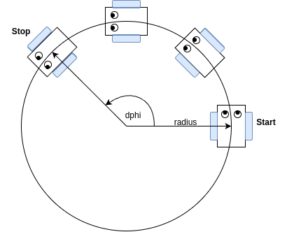
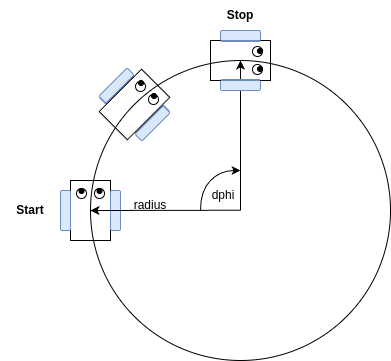

# Robot Control :robot:

The use of this project is to control a VisionRobot, more precise a robot, running on a Raspberry Pi like platform. 

Features included are navigation planning, a camera integration of a Picamera to detect and interpret cv2 Aruco Markers and a communcation stack to communicate with a host PC and the Micro Controller.

---

## <u>Content</u>

1. [Quick Start](#quick-start)

2. [Module Overview](#module-overview)
   
   1. [Aruco Detection](#aruco-detection)
   
   2. [Navigation](#navigation)

## <u>Quick Start</u>

### Tested Hard- and Software

- Raspi: Compute Module 4

- Camera: [Raspberry Pi Camera Module 3](https://www.berrybase.de/raspberry-pi-camera-module-3-wide-12mp)

- OS: Raspbian Bullseye, 64 Bit

### Startup

Setup a Raspi/Compute-Module-Robot 

- Checkout the [STM32 microcontroller code](https://git.tu-berlin.de/theses1/bsc_cooperative_sensing) and install it

- Connect to your robot via ethernet or wifi

- Make sure you can ping/ssh on to your robot

- Keep going with Option [a)](#installation-with-install-scripts-linux) if you are on Linux or skip to Option [b)](#installation-with-install-scripts-windows) for Windows, or with option [c)](#installation-by-hand) if you want to do everything by hand and understand, what is going on

### Installation with install scripts [Linux]

- change to *install* folder of the repo 

- run *install.sh* script with the login name and hostname/ip of your robot
  
  ```bash
  cd install && ./install.sh username@hostname/hostip 
  ```

- you will have to authenticate for your raspi two times
  
  1. to copy the necessary files 
  
  2. to run the actual install script on the raspi itself

- go to [verification](#verification-of-installation)

### Installation with install scripts [Windows]

- copy the *install_robot_control.sh*, *requirements.txt* and *test_aruco.py* to your raspi

- run the *install_robot_control.sh* script (sudo authentication might be necessary)
  
  ```bash
  ./install_robot_control.sh
  ```

- go to [verification](#verification-of-installation)

### Installation by hand

- install following debian packages:
  
  ```bash
  libgl1 libcap-dev python3 python3-pip python3-picamera2  python3-dev python3-libcamera python3-kms++
  ```

- install pip packages defined in *install/requirements.txt*
  
  ```bash
  pip3 install -r requirements.txt
  ```

- install adafruit-blinka
  
  ```bash
  wget https://raw.githubusercontent.com/adafruit/Raspberry-Pi-Installer-Scripts/master/raspi-blinka.py
  sudo pip install adafruit-python-shell
  sudo python3 raspi-blinka.py
  ```
  
  follow raspi-blinka installation guide, don't reboot yet on finish

- add `dtoverlay=imx708,cam1` to */boot/config.txt* 
  
  parameter overview by camera type:
  
  | Camera Version                           | Overlay Command       |
  | ---------------------------------------- | --------------------- |
  | v3                                       | dtoverlay=imx708,cam1 |
  | v2                                       | dtoverlay=imx219,cam1 |
  | v1 (and most of<br/>non raspi officials) | dtoverlay=ov5647,cam1 |

- go to [verification](#verification-of-installation)

### Verification of Installation

- reboot your raspi

- check with the `test_aruco.py` if the installation was succesfull

- on succes, the script returns something like
  
  ```
  Initializing Camera
  Testing camera
  Found Marker  [3]  in distance  0.4829704748794956
  ```
  
  if you have some Aruco Markers in your camera sight or 
  
  ```
  Initializing Camera
  Testing camera
  No Markers found, but everything else is working!
  ```
  
  if you have no markers in sight of the camera

### Possible Problems

- Camera Problems:
  
  - Cable connected correctly?
  
  - `dtoverlay=imx708,cam1` in */boot/config.txt*?
  
  - read [here](https://www.raspberrypi.com/documentation/computers/camera_software.html#configuration) for more information

- ...

## <u>Module Overview</u>

### Aruco Detection

The Aruco Detection module is a wrapper for the cv2 Aruco library, combining it with the Picamera2 library to have a working combination of camera and aruco detector.

It is independent of the rest of the robot, so it will also work with a regular Raspberry Pi with a connected Picamera.

#### Calibration

- necessary for precision of aruco measurements

- compensates "non-linearities" in images because of lens
  
  :arrow_right: one calibration per camera type is sufficient (e.g. once a calibration for a Raspi Camera 3 Wide is done, it can be used for all Raspi Camera 3 Wide cameras)

- consists of:
  
  1. camera matrix
  
  2. distortion coefficient

. can be created with ArucoDetector with calibrate=True parameter

#### Functionality

- camera calibration (if necessary)

- live analysis of video feed

- streaming of video feed & found aruco markers to Flask Webserver

- measurement options:
  
  1. automatic: 
     
     - continuously capture camera frames and analyse them for aruco markers
     
     - when activated, the program will ask you to input a measurement name
     
     - after hitting enter, 10 measurements are done over 3 seconds
     
     - analysed rotation and translation vectors are printed to stdout (can be piped to a file; all irrelevant information is printed to stderr!)
     
     - <u>analysis only of one visible Aruco Marker!!!</u>
     
     - for debug purposes, the distance from camera to aruco marker derived from the translation vector is printed to stderr as simple quality control
  
  2- manually:
  
  - camera frames are only captured when ArucoDetector *measurement* function is called & analyzed for aruco markers
  
  - *measurement* function returns list of found marker IDs, list of found translation vectors and list of found rotation vectors
  
  :information_source: Rotation Vectors by cv2 are in "Rodrigues" format, meaning that their norm/lengh equals the rotation angle in radiants and the vector itself is the rotation axis (can be directly converted to quaternions with qmt) :information_source:

### Navigation

The Navigation module contains functionalities to navigate a differential drive robot. Purpose of the navigation is not to reach a single end point in a grid or something like that, but to have a convenient way to move multiple robots in special test scenarios, synchronized with each other.

Central idea of the movement method is, that you can describe every single movement of a differential drive robot as a circular movement using three parameters:

1. dphi: describing the angle in rad, which the robot will drive on the circular arc

2. radius: the radius of the circle, on that the robot is driving

3. time: the time, that the robot has to get to it's destination

Lets get some examples, excluding the time parameter for the beginning:

Example 1: left turn



Here we have a left turn. We could describe it with dphi = $\frac{3}{4}\pi$ and e.g. radius r = 300mm. We define a left turn to have a positive dphi, derived from math. positive direction.

Example 2: right turn



Here we have a right turn. Anticipating, that both radii are the same, we could describe it with dphi = $-\frac{1}{2}\pi$ and e.g. radius r = 300mm.

With that, we can describe a lot of motions. Let's have a look at what else is possible:

- left turn: dphi > 0; example: dphi = $\frac{3}{4}\pi$, r = 300mm

- right turn: dphi < 0; example: dphi = $-\frac{1}{2}\pi$, r = 300mm

- straight movement: dphi = 0; example: dphi = 0, r = 300mm

- stop: dphi = 0; r = 0mm;

- turn at place: r = 0mm; example: dphi = $\pi$, r = 0mm
